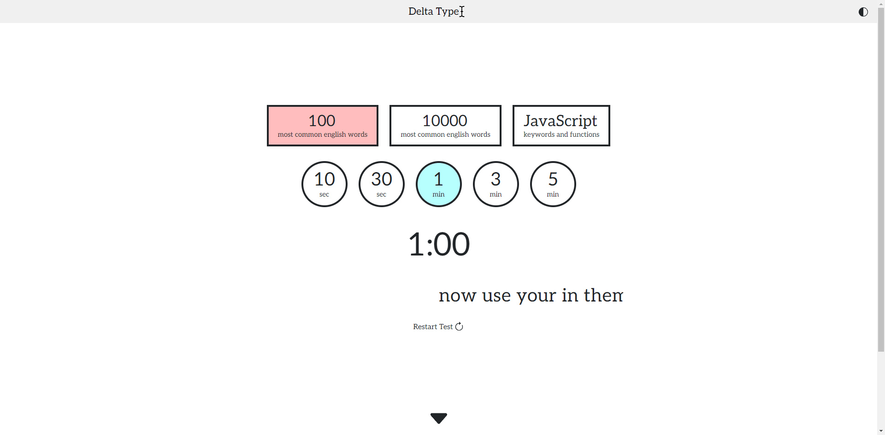

# Delta Type
An ergonomic and simple **typing speed test** website.

Desktop and mobile platforms are both supported!




### Word sets
- 100 most common English words
- 1000 most common English words
- JavaScript reserved keywords and common functions

### Test durations
- 10 seconds
- 30 seconds
- 1 minute
- 3 minutes
- 5 minutes

Also, **dark mode** is available! (Toggled by clicking the upper right semi-circle icon)

## Link
[Click here to access the website!](https://delta-type.netlify.app/)

## Project setup
```
npm install
```

### Compile for development
```
npm run dev
```

### Compile for production and preview
```
npm run build
npm run preview
```

## Author
Developed by [Vincent Simard-Schmidt](https://www.linkedin.com/in/vincent-simard-schmidt-1a2645215/).
